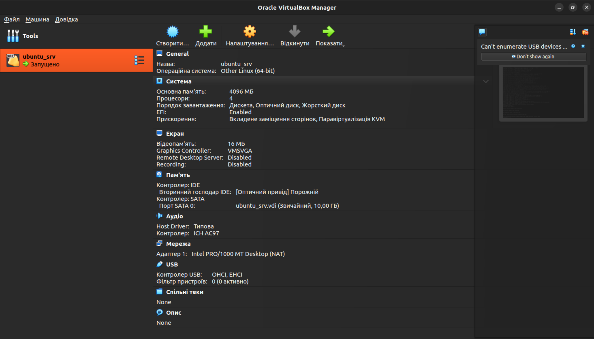
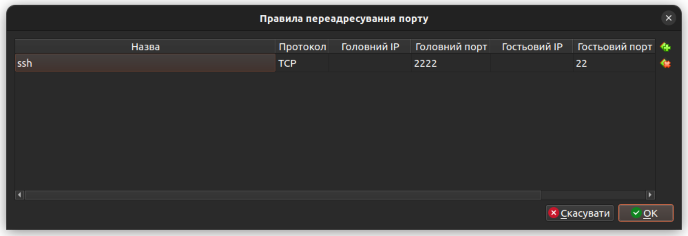
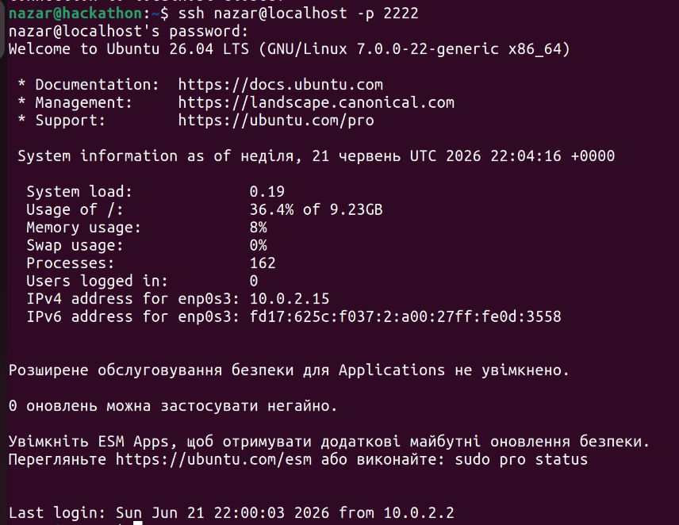
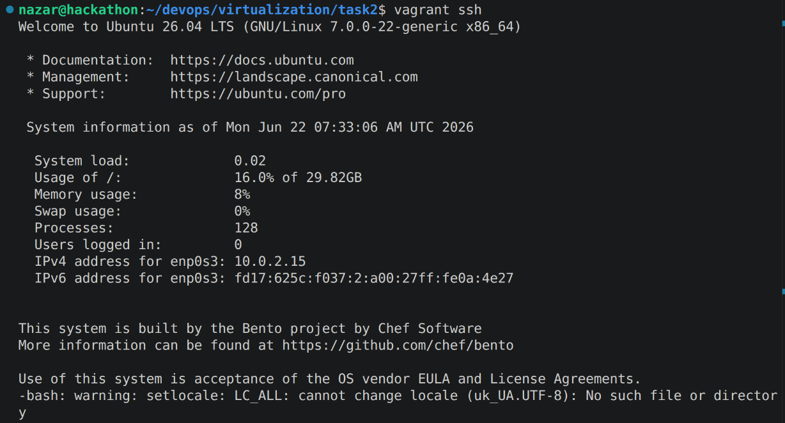

# Віртуалізація - завдання

## Task 1 (✦)
1. Install VirtualBox on your computer.
    - Встановив VirtualBox за офіційною інстукцією: https://www.virtualbox.org/wiki/Linux_Downloads
2. Download the Ubuntu Server ISO image.
    - Завантажив Ubuntu Server iso за посиланням: https://ubuntu.com/download/server
3. Create a virtual machine in VirtualBox using the Ubuntu Server image.
    - Створив віртуальну машину: 
4. Forward a port (e.g., 2222 on your host) to port 22 (SSH) of the virtual machine.
    - Переадресував порт 2222 на хості на порт 22 на віртуальній машині:
    
5. Connect to the virtual machine via SSH from the host machine (e.g., using PuTTY or Windows CLI).
    - Піключився через ssh:
    
6. Log in to the system and create a file in your home directory (e.g., task1.txt) with the following content:
Hello from the Ubuntu Server!
    - Через підключення через ssh використав nano для створення файлу з вмістом:

        ```shell
        nazar@usrv:~$ nano task1.txt
        nazar@usrv:~$ cat task1.txt 
        Hello from the Ubuntu Server!
        ```

## Task 2 (✦✦)
1. Install Vagrant.
    - Встановив Vagrant за офіційною інстукцією за посиланням: https://developer.hashicorp.com/vagrant/install#linux

    ```shell
    nazar@hackathon:~$ vagrant --version
    Vagrant 2.4.9
    ```
2. Write a Vagrantfile to create a virtual machine based on Ubuntu Server.
    - Створив Vagrantfile з ubuntu-26.04 box від bento: https://portal.cloud.hashicorp.com/vagrant/discover/bento/ubuntu-26.04

3. Configure Vagrant to automatically forward port 2222 to port 22 on the virtual machine.
    - Переадресація портів:
    ```Ruby
    config.vm.network "forwarded_port",
    guest: 22,
    host: 2222
    ```
4. Run vagrant up to create and launch the virtual machine.
    - Запустив vagrant up:
    ```shell
    nazar@hackathon:~/devops/virtualization/task2$ vagrant up
    Bringing machine 'usrv' up with 'virtualbox' provider...
    ==> usrv: Box 'bento/ubuntu-26.04' could not be found. Attempting to find and install...
        usrv: Box Provider: virtualbox
        usrv: Box Version: >= 0
    ==> usrv: Loading metadata for box 'bento/ubuntu-26.04'
        usrv: URL: https://vagrantcloud.com/api/v2/vagrant/bento/ubuntu-26.04
    ==> usrv: Adding box 'bento/ubuntu-26.04' (v202606.01.0) for provider: virtualbox (amd64)
        usrv: Downloading: https://vagrantcloud.com/bento/boxes/ubuntu-26.04/versions/202606.01.0/providers/virtualbox/amd64/vagrant.box
    ==> usrv: Successfully added box 'bento/ubuntu-26.04' (v202606.01.0) for 'virtualbox (amd64)'!
    ==> usrv: Importing base box 'bento/ubuntu-26.04'...
    ==> usrv: Matching MAC address for NAT networking...
    ==> usrv: Checking if box 'bento/ubuntu-26.04' version '202606.01.0' is up to date...
    ==> usrv: Setting the name of the VM: task2_usrv_1782113457834_21991
    Vagrant is currently configured to create VirtualBox synced folders with
    the `SharedFoldersEnableSymlinksCreate` option enabled. If the Vagrant
    guest is not trusted, you may want to disable this option. For more
    information on this option, please refer to the VirtualBox manual:

    https://www.virtualbox.org/manual/ch04.html#sharedfolders

    This option can be disabled globally with an environment variable:

    VAGRANT_DISABLE_VBOXSYMLINKCREATE=1

    or on a per folder basis within the Vagrantfile:

    config.vm.synced_folder '/host/path', '/guest/path', SharedFoldersEnableSymlinksCreate: false
    ==> usrv: Clearing any previously set network interfaces...
    ==> usrv: Preparing network interfaces based on configuration...
        usrv: Adapter 1: nat
    ==> usrv: Forwarding ports...
        usrv: 22 (guest) => 2222 (host) (adapter 1)
        usrv: 22 (guest) => 2222 (host) (adapter 1)
    ==> usrv: Booting VM...
    ==> usrv: Waiting for machine to boot. This may take a few minutes...
        usrv: SSH address: 127.0.0.1:2222
        usrv: SSH username: vagrant
        usrv: SSH auth method: private key
        usrv: 
        usrv: Vagrant insecure key detected. Vagrant will automatically replace
        usrv: this with a newly generated keypair for better security.
        usrv: 
        usrv: Inserting generated public key within guest...
        usrv: Removing insecure key from the guest if it's present...
        usrv: Key inserted! Disconnecting and reconnecting using new SSH key...
    ==> usrv: Machine booted and ready!
    ==> usrv: Checking for guest additions in VM...
        usrv: The guest additions on this VM do not match the installed version of
        usrv: VirtualBox! In most cases this is fine, but in rare cases it can
        usrv: prevent things such as shared folders from working properly. If you see
        usrv: shared folder errors, please make sure the guest additions within the
        usrv: virtual machine match the version of VirtualBox you have installed on
        usrv: your host and reload your VM.
        usrv: 
        usrv: Guest Additions Version: 7.2.8
        usrv: VirtualBox Version: 7.1
    ==> usrv: Mounting shared folders...
        usrv: /home/nazar/devops/virtualization/task2 => /vagrant
    ==> usrv: Running provisioner: shell...
        usrv: Running: inline script
        usrv: Hello
    ```
5. Use vagrant ssh to log in to the virtual machine.
    - Використав vagrant ssh:
    
6. Inside the VM, create a file named vagrant_task.txt in the home directory with the following content:
This VM was created by Vagrant!
    - Створив файл:
    ```shell
    vagrant@vagrant:~$ nano vagrant_task.txt
    vagrant@vagrant:~$ cat vagrant_task.txt 
    This VM was created by Vagrant!
    ```

## Task 3 (✦✦✦)
1. Modify the Vagrantfile to:
    1. Launch two servers:
        - Використовував box bento/ubuntu-26.04: https://portal.cloud.hashicorp.com/vagrant/discover/bento/ubuntu-26.04
        1. web server (e.g., using the ubuntu/bionic64 box, named web, with a startup command echo "Web server ready").
        2. db server (e.g., using the ubuntu/focal64 box, named db, with a startup command echo "Database server ready").
    2. Both machines should have different forwarded SSH ports (e.g., 2222 for web and 3333 for db).
        - Налаштував переадресацію:
        ```Ruby
        web.vm.network "forwarded_port", guest: 22, host: 2222
        db.vm.network "forwarded_port", guest: 22, host: 3333
        ```
2. Ensure that you can connect via SSH to both servers from the host machine.
    - Перевірив з'єднання:
    ```shell
    nazar@hackathon:~/devops/virtualization/task3$ vagrant ssh web
    Welcome to Ubuntu 26.04 LTS (GNU/Linux 7.0.0-22-generic x86_64)
    nazar@hackathon:~/devops/virtualization/task3$ vagrant ssh db
    Welcome to Ubuntu 26.04 LTS (GNU/Linux 7.0.0-22-generic x86_64)
    ```
3. On the web server, create a file named web_status.txt with the content:<br>`This is the Web server.` <br>On the db server, create a file named db_status.txt with the content: <br>`This is the Database server.`
    - Створив файли:
    ```shell
    vagrant@vagrant:~$ nano web_status.txt
    vagrant@vagrant:~$ cat web_status.txt 
    This is the Web server.
    ```
    ```shell
    vagrant@vagrant:~$ nano db_status.txt
    vagrant@vagrant:~$ cat db_status.txt 
    This is the Database server.
    ```
4. Ensure that your Vagrantfile automates the creation of these files during the VM setup process.
    - Додано рядки для автостворення файлів:
    ```Ruby
    web.vm.provision "shell", path: "web_create_file.sh", privileged: false
    db.vm.provision "shell", path: "db_create_file.sh", privileged: false
    ```

## Task 4 (✦✦✦✦)
1. Extend the Vagrantfile to:
    1. Create three virtual machines:
        - Використовував box bento/ubuntu-26.04: https://portal.cloud.hashicorp.com/vagrant/discover/bento/ubuntu-26.04
        1. web server: Use the ubuntu/bionic64 box and install Nginx automatically during provisioning. Configure it to serve a static HTML page with the content: 
        ```html
        <h1>Welcome to the Web Server!</h1>
        ```
        2. db server: Use the ubuntu/focal64 box, and install MySQL during provisioning. Set up a sample database test_db with a table users and insert sample data:
        ```sql
        INSERT INTO users (id, name) VALUES (1, 'Alice'), (2, 'Bob’);
        ```
        3. monitoring server: Use the ubuntu/bionic64 box and install Prometheus during provisioning. Configure it to monitor the web and db servers using static targets.
2. Ensure all machines use private networking to communicate with each other.
    - Додано приватну мережу:
    ```Ruby
    web.vm.network "private_network", ip: "192.168.60.10"
    db.vm.network "private_network", ip: "192.168.60.20"
    mon.vm.network "private_network", ip: "192.168.60.30"
    ```
2. Configure provisioning scripts for each server to automate the tasks:
    - web server: Ensure the web server serves the static page when accessed via HTTP (e.g., on port 8080 forwarded to port 80).
        - Для вебсервера використано Apache HTTP Server: https://httpd.apache.org/
        - Встановлення і створення index.html: [web_configure.sh](task4/web_configure.sh)
        - Переадресовано порти:
        ```Ruby
        web.vm.network "forwarded_port", guest: 80, host: 8080
        ```
    - db server: The MySQL database should allow the web server to connect over the private network. Use environment variables for the database credentials.
        - Встановлення бази даних MySQL та створення бази даних `test_db`, таблиці `users` і додавання двох записи: [db_configuration.sh](tast4/db_configuration.sh)
        - Переадресовано порти:
        ```Ruby
        db.vm.network "forwarded_port", guest: 3306, host: 33060
        ```
    - monitoring server: Prometheus should scrape metrics from web (HTTP) and db (MySQL) servers.
        - Переадресовано порти:
        ```Ruby
        mon.vm.network "forwarded_port", guest: 9090, host: 9090
        ```
